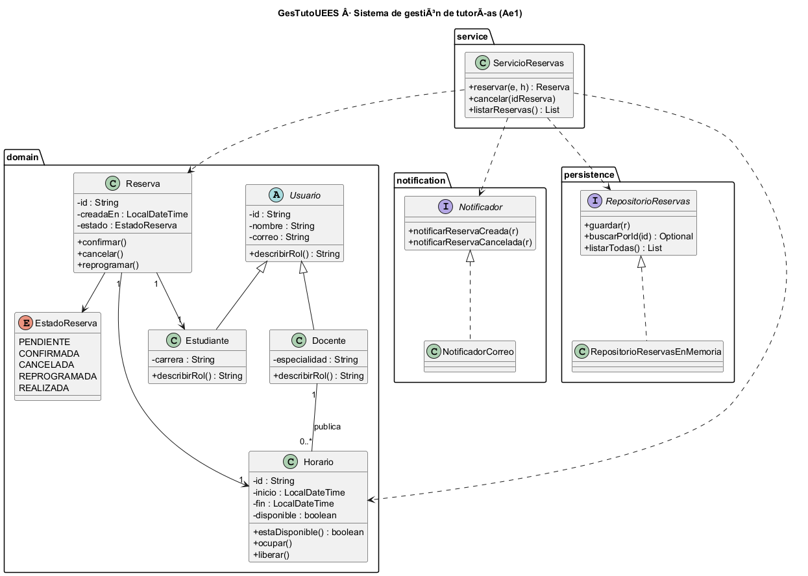

# GesTutoUEES · Sistema de gestión de tutorías

Modelo de dominio de un sistema de tutorías académicas, hecho para la Actividad 5 (Ae1)
de Diseño de Software. La idea no era solo que compile: era que las clases tengan
responsabilidades claras y que el sistema aguante cambios sin romperse por todos lados.

**Repositorio:** https://github.com/cidmikeEC/GesTutoUEES

---

## El problema, en corto

Un estudiante quiere una tutoría con un docente. El docente publica horarios libres,
el estudiante reserva uno, el sistema avisa y lleva el control. Suena simple, pero hay
reglas que no se pueden romper: un horario ocupado no se puede reservar dos veces, una
reserva cancelada tiene que liberar su horario, y el aviso al docente no puede depender
de que usemos correo hoy y otra cosa mañana.

## Clases principales y qué hace cada una

| Clase | Responsabilidad |
| :--- | :--- |
| `Usuario` (abstracta) | Lo común de cualquier persona del sistema. Nadie es "usuario genérico". |
| `Estudiante` / `Docente` | Heredan de `Usuario`. Uno solicita, el otro ofrece. |
| `Horario` | Un bloque de tiempo. Protege su disponibilidad (`ocupar`/`liberar`). |
| `Reserva` | El encuentro. Cuida su propio ciclo de vida (confirmar, cancelar, reprogramar). |
| `ServicioReservas` | Orquesta la lógica: reservar, cancelar, listar. |
| `Notificador` (interfaz) | Abstracción del aviso. Hoy correo, mañana lo que sea. |
| `RepositorioReservas` (interfaz) | Abstracción de la persistencia. Hoy memoria, mañana BD. |

## Decisiones de diseño (y por qué)

**Herencia solo donde es verdad.** `Estudiante` y `Docente` heredan de `Usuario` porque
*son* usuarios, no para reutilizar código. Si mañana aparece un "Coordinador", hereda
también y el resto no se entera.

**Composición para lo demás.** Una `Reserva` *tiene* un `Estudiante` y un `Horario`;
no hereda de ellos. Meter herencia ahí sería forzar la relación.

**El estado se protege, no se expone.** El `Horario` no deja que nadie le cambie
`disponible` desde fuera: solo `ocupar()` y `liberar()`. Así la regla anti doble
reserva vive en un solo lugar y no se puede saltar por accidente.

## Cohesión y acoplamiento

Cada clase hace una cosa. `Horario` maneja su tiempo, `Reserva` su ciclo de vida,
`ServicioReservas` coordina. Eso es cohesión alta: si algo falla en la reserva, sé
exactamente a qué clase ir.

El acoplamiento se controla con las dos interfaces. `ServicioReservas` no sabe si el
aviso sale por correo o por WhatsApp, ni si los datos van a memoria o a una base de
datos: solo habla con `Notificador` y `RepositorioReservas`. Cambiar la tecnología de
persistencia o de notificación toca una clase nueva, no el dominio.

## Principios SOLID aplicados

**DIP (Dependency Inversion).** `ServicioReservas` depende de las abstracciones
`Notificador` y `RepositorioReservas`, no de `NotificadorCorreo` ni de
`RepositorioReservasEnMemoria`. Las implementaciones se inyectan por el constructor
(en `Main`). Si cambio la persistencia, el servicio no se modifica.

**SRP (Single Responsibility).** Cada clase tiene una razón para cambiar. `Reserva`
cambia si cambian las reglas de la reserva; `NotificadorCorreo` cambia si cambia el
canal de aviso. No hay una clase "que hace de todo".

**OCP (Open/Closed).** Se puede agregar un `NotificadorSms` o un
`RepositorioReservasPostgres` sin tocar el código que ya funciona: se extiende, no se
modifica.

## Diagrama UML



El fuente está en `docs/modelo-clases.puml` (PlantUML). El UML y el código cuentan la
misma historia: lo que está en uno está en el otro.

## Estructura

```text
sistema-tutorias/
├── pom.xml
├── docs/
│   ├── modelo-clases.puml
│   └── modelo-clases.png
└── src/main/java/edu/uees/tutorias/
    ├── Main.java                  (demostración por consola)
    ├── domain/        Usuario, Estudiante, Docente, Horario, Reserva, EstadoReserva
    ├── service/       ServicioReservas
    ├── notification/  Notificador, NotificadorCorreo
    └── persistence/   RepositorioReservas, RepositorioReservasEnMemoria
```

## Cómo compilar y ejecutar

Requisitos: Java 17 y Maven.

```bash
mvn clean compile
```

Para ver la demostración del flujo (publicar → reservar → notificar → cancelar):

```bash
java -cp target/classes edu.uees.tutorias.Main
```

## Declaración de uso de IA

Durante el desarrollo de esta actividad utilicé herramientas de inteligencia artificial
como apoyo para estructurar el proyecto y redactar borradores. Verifiqué, adapté y
comprendí el código y las decisiones aquí presentadas, y puedo explicarlas y
justificarlas.