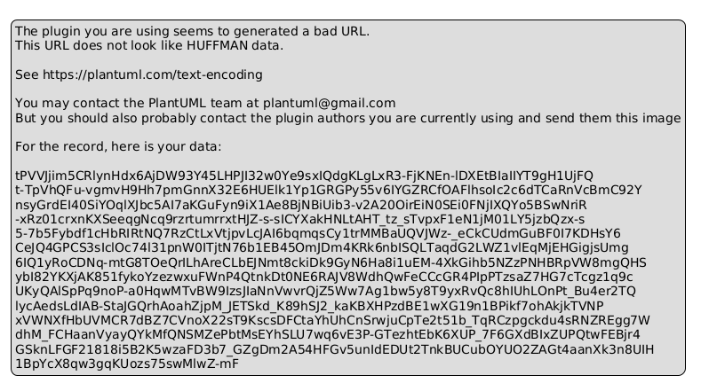
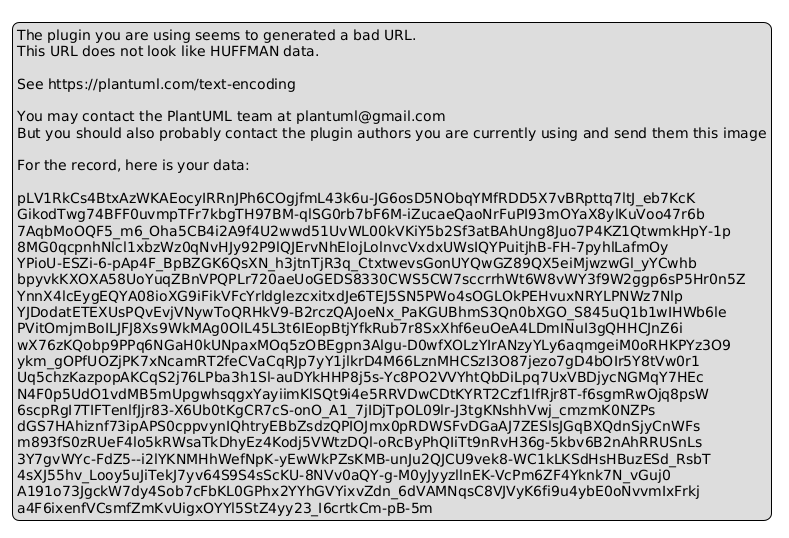

# GesTutoUEES · Sistema de gestión de tutorías

Sistema de gestión y reserva de tutorías académicas universitarias desarrollado en Java 17 y Maven para la asignatura de **Diseño de Software (UCOM0310)** de la **Universidad Espíritu Santo (UEES)**.

**Autor:** Miguel Iván Delgado Anazco  
**Docente:** Ph.D. Jaime Sayago Heredia  
**Repositorio GitHub:** [https://github.com/cidmikeEC/GesTutoUEES](https://github.com/cidmikeEC/GesTutoUEES)

---

## 🎯 Propósito de la Actividad (Ae2 · Semana 3)

Implementar y comparar técnicamente los patrones creacionales **Factory Method** y **Builder** sobre el dominio de **GesTutoUEES**, resolviendo problemas concretos de escalabilidad, acoplamiento y legibilidad en la creación de objetos:

1. **Factory Method (Mecanismos de Notificación):** Desacoplar la lógica de despacho de avisos respecto a los canales concretos de comunicación (Correo institucional, SMS, WhatsApp y Microsoft Teams), garantizando el cumplimiento estricto del principio *Open/Closed (OCP)*.
2. **Builder con Fluent API (Construcción de Reservas):** Erradicar el antipatrón de *constructor telescópico* en la entidad `Reserva`, soportando atributos obligatorios y opcionales con valores por defecto y validaciones de consistencia de negocio en tiempo de construcción.

---

## 🏭 Parte A · Patrón Factory Method

### 1. Problema inicial
En la versión inicial, el sistema dependía directamente de una implementación fija (`NotificadorCorreo`). Al requerir nuevos canales de notificación (SMS, WhatsApp, Bots de Teams), la tentación tradicional es introducir condicionales `switch (canal)` dentro del servicio. Este enfoque:
- Viola el principio **Open/Closed (OCP)**: cada nuevo canal obliga a modificar el código existente.
- Aumenta el acoplamiento: el cliente debe conocer todas las clases concretas y cómo configurarlas.

### 2. Solución con Factory Method
Se define una jerarquía creadora (`CreadorNotificador`) donde la operación de negocio (`enviarNotificacionReserva`) opera contra el contrato abstracto `Notificador` (Product), delegando la instanciación al método fábrica abstracto `crearNotificador()`.

```text
edu.uees.tutorias.notification/
├── Notificador.java                  (Product interface)
├── NotificadorCorreo.java            (ConcreteProduct)
├── NotificadorSMS.java               (ConcreteProduct)
├── NotificadorWhatsApp.java          (ConcreteProduct)
├── NotificadorTeams.java             (ConcreteProduct - Variante Extensible)
├── CreadorNotificador.java           (Creator abstracto)
├── CreadorNotificadorCorreo.java     (ConcreteCreator)
├── CreadorNotificadorSMS.java        (ConcreteCreator)
├── CreadorNotificadorWhatsApp.java   (ConcreteCreator)
└── CreadorNotificadorTeams.java      (ConcreteCreator - Variante Extensible)
```

### 3. Evidencia de Extensibilidad (OCP)
Para incorporar **Microsoft Teams** como canal institucional, **no se modificó una sola línea** de `Notificador.java`, `CreadorNotificador.java` ni de `ServicioReservas.java`. Únicamente se crearon dos nuevas clases (`NotificadorTeams` y `CreadorNotificadorTeams`).

### Diagrama UML · Factory Method


---

## 🔨 Parte B · Patrón Builder con Fluent API

### 1. Problema inicial (Constructor Telescópico)
Al enriquecer la entidad `Reserva` con modalidades (Virtual vs Presencial), enlaces Teams, aulas físicas, cupos grupales, tiempos de recordatorio y observaciones, un constructor convencional requeriría más de 10 parámetros:
```java
// Antipatrón: constructor telescópico confuso y propenso a errores
Reserva r = new Reserva("RES-1", est, hor, "Diseño", "Patrones", Modalidad.VIRTUAL, "https://...", null, 30, false, 1, "nota", LocalDateTime.now(), Estado.PENDIENTE);
```
Este diseño provoca:
- Dificultad para recordar el orden de los argumentos booleanos y enteros.
- Necesidad de pasar múltiples valores `null` para campos que no aplican según la modalidad.
- Incapacidad de validar reglas cruzadas antes de crear el objeto.

### 2. Solución con Builder
Se implementó `ReservaBuilder` con una **Fluent API** encadenable, inmutabilidad garantizada en `Reserva` y validaciones estrictas en el método `.build()`:
- **Campos obligatorios:** ID, Estudiante, Horario, Materia, Tema.
- **Valores por defecto inteligentes:** Modalidad Virtual, recordatorio de 30 min, cupo individual de 1, enlace autogenerado.
- **Validaciones de negocio:** Si es presencial exige aula física; si es grupal exige cupo $\ge 2$; tiempos de recordatorio no negativos.

```java
// Construcción legible, validada y expresiva
Reserva reserva = Reserva.builder()
        .conId("RES-2026-001")
        .paraEstudiante(estudiante)
        .enHorario(horario)
        .conMateria("Estructura de Datos")
        .conTema("Árboles AVL")
        .modalidadVirtual()
        .conRecordatorioMinutos(15)
        .build();
```

### Diagrama UML · Builder


---

## 📊 Parte C · Comparación Técnica de Patrones

| Criterio | Factory Method | Builder |
| :--- | :--- | :--- |
| **Problema que resuelve** | Acoplamiento a clases concretas al crear familias de objetos derivados de un contrato común. | Complejidad al construir objetos complejos con múltiples atributos obligatorios y opcionales. |
| **Variabilidad principal** | **Qué tipo de objeto** concreto instanciar (diferentes tipos de notificadores polimórficos). | **Cómo se configura y ensambla** un mismo objeto paso a paso (variaciones de una misma `Reserva`). |
| **Participantes clave** | `Product`, `ConcreteProduct`, `Creator`, `ConcreteCreator`. | `Product`, `Builder`, `ConcreteBuilder`, `Client` (y opcionalmente `Director`). |
| **Ventaja principal** | Extensibilidad limpia bajo OCP (Open/Closed); polimorfismo en la creación. | Legibilidad (Fluent API), inmutabilidad del producto final y validación previa a instanciar. |
| **Costo / consecuencia** | Proliferación de clases (requiere crear una subclase creadora por cada producto concreto). | Mayor código inicial de infraestructura (*boilerplate*) para el builder y sus métodos fluidos. |
| **Cuándo utilizarlo** | Cuando el creador no sabe de antemano la clase exacta del objeto que debe instanciar. | Cuando un objeto tiene constructores con muchos parámetros (telescópico) o configuraciones cruzadas. |
| **Cuándo evitarlo** | Cuando la jerarquía de productos es estática y no variará a lo largo del tiempo. | Cuando el objeto es simple, inmutable de 2–3 campos fijos o un simple DTO plano. |

---

## 🏗️ Estructura del Repositorio

```text
sistema-tutorias/
├── pom.xml
├── docs/
│   ├── factory-method.puml
│   ├── factory-method.png
│   ├── builder.puml
│   ├── builder.png
│   ├── modelo-clases.puml
│   └── modelo-clases.png
├── src/
│   ├── main/java/edu/uees/tutorias/
│   │   ├── Main.java
│   │   ├── domain/
│   │   │   ├── Usuario.java, Estudiante.java, Docente.java
│   │   │   ├── Horario.java, EstadoReserva.java, ModalidadTutoria.java
│   │   │   ├── Reserva.java
│   │   │   └── ReservaBuilder.java
│   │   ├── notification/
│   │   │   ├── Notificador.java
│   │   │   ├── NotificadorCorreo.java, NotificadorSMS.java
│   │   │   ├── NotificadorWhatsApp.java, NotificadorTeams.java
│   │   │   ├── CreadorNotificador.java
│   │   │   ├── CreadorNotificadorCorreo.java, CreadorNotificadorSMS.java
│   │   │   └── CreadorNotificadorWhatsApp.java, CreadorNotificadorTeams.java
│   │   ├── persistence/
│   │   │   ├── RepositorioReservas.java
│   │   │   └── RepositorioReservasEnMemoria.java
│   │   └── service/
│   │       └── ServicioReservas.java
│   └── test/java/edu/uees/tutorias/
│       ├── FactoryMethodTest.java
│       ├── ReservaBuilderTest.java
│       └── ServicioReservasTest.java
```

---

## 🚀 Compilación y Pruebas

Requisitos: **JDK 17** y **Maven 3.8+**.

```bash
# Compilar y ejecutar pruebas unitarias automatizadas (15 tests)
mvn clean test

# Ejecutar la demostración interactiva por consola
java -cp target/classes edu.uees.tutorias.Main
```

---

## 📝 Declaración de uso ético de IA

Durante el desarrollo de esta actividad utilicé herramientas de inteligencia artificial como apoyo para la estructuración de patrones creacionales, generación de diagramas PlantUML y redacción técnica de la comparativa. Revisé, probé, refactoricé y comprendí todo el código Java y las decisiones de diseño presentadas, y puedo explicar y defender técnicamente cada solución.