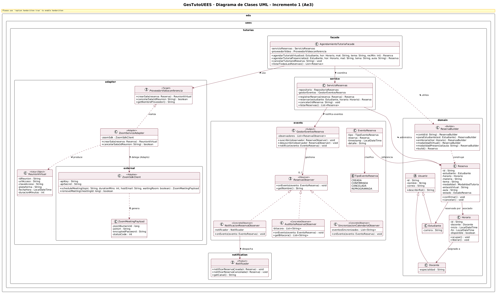

# GesTutoUEES · Sistema de gestión de tutorías

Sistema integral de gestión, reserva y auditoría de tutorías académicas universitarias desarrollado en Java 17 y Maven para la asignatura de **Diseño de Software (UCOM0310)** de la **Universidad Espíritu Santo (UEES)**.

**Autor:** Miguel Iván Delgado Anazco  
**Docente:** Ph.D. Jaime Paul Sayago Heredia  
**Repositorio GitHub:** [https://github.com/cidmikeEC/GesTutoUEES](https://github.com/cidmikeEC/GesTutoUEES)  
**Entrega:** Actividad 5 | Ae3 – Incremento 1 del proyecto integrador  

---

## 🎯 1. Propósito del Proyecto y Alcance del Incremento 1

Integrar diseño orientado a objetos y patrones de diseño (estructurales, de comportamiento y creacionales) en un incremento funcional, documentado y versionado de **GesTutoUEES**, de modo que las responsabilidades, dependencias y puntos de variación sean explícitos y desacoplados bajo principios SOLID.

### Evolución respecto a incrementos anteriores (Ae1 y Ae2)
- **Ae1 (Diseño Orientado a Objetos Base):** Modelado del dominio (`Usuario`, `Estudiante`, `Docente`, `Horario`, `Reserva`), asignación de responsabilidades bajo alta cohesión y bajo acoplamiento, aplicación de SOLID y arquitectura limpia en Maven.
- **Ae2 (Patrones Creacionales):**
  - **Builder:** `ReservaBuilder` con Fluent API, validaciones cruzadas e inmutabilidad (erradicando el constructor telescópico).
  - **Factory Method:** Jerarquía creadora (`CreadorNotificador`) y de productos (`NotificadorTeams`, `NotificadorCorreo`, etc.) bajo OCP.
- **Ae3 (Incremento 1 · Semana 4):**
  - **Adapter (Estructural):** Integración con la API externa propietaria de videoconferencias (**Zoom Video Communications**), adaptando su SDK incompatible al contrato del dominio `ProveedorVideoconferencia`.
  - **Observer (Comportamiento):** Desacoplamiento del ciclo de vida de la reserva (`CREADA`, `CONFIRMADA`, `CANCELADA`) mediante un gestor de eventos reactivo que despacha simultáneamente a **Notificaciones multicanal** (reutilizando Factory Method de Ae2), **Auditoría institucional inmutable** y **Sincronización de calendario 365**.
  - **Facade (Estructural):** Fachada `AgendamientoTutoriaFacade` que unifica para clientes externos y controladores las operaciones complejas de agendamiento virtual y presencial en una sola interfaz limpia y cohesiva.

---

## 🧭 2. Revisión y Justificación de Patrones Heredados (Ae2)

| Patrón | Problema que resuelve en mi proyecto | ¿Se mantiene? | Justificación técnica |
| :--- | :--- | :---: | :--- |
| **Builder** | Antipatrón del constructor telescópico en la entidad `Reserva` (más de 10 atributos obligatorios y opcionales entre virtual y presencial). | **SÍ** | Permite construir instancias consistentes con valores por defecto inteligentes, validaciones estrictas en `.build()` e inmutabilidad de la entidad. |
| **Factory Method** | Acoplamiento rígido a clases concretas al despachar avisos por diversos canales institucionales. | **SÍ** | Se preserva y se integra como suscriptor dentro del patrón Observer (`NotificacionReservaObserver`), despachando notificaciones a Teams, WhatsApp o Correo sin acoplar el servicio central. |

---

## 🧩 3. Patrones de Semana 4 Integrados (Incremento 1)

### Plantilla de Justificación de Patrones (Sección 7 del Requerimiento Oficial)

| Elemento | Patrón 1: Observer (Comportamiento) | Patrón 2: Adapter (Estructural) | Patrón 3: Facade (Estructural) |
| :--- | :--- | :--- | :--- |
| **Problema real** | Acoplamiento 1-a-1 en `ServicioReservas`. Cuando una reserva cambia de estado, múltiples receptores independientes (notificaciones, auditoría, calendario) necesitan actuar sin que el servicio los conozca. | Incompatibilidad de interfaz al conectar con la API en la nube de Zoom (`ZoomSdkClient`), que maneja parámetros en inglés y tipos numéricos ajenos a nuestro dominio. | El cliente (consola/controlador) debe conocer y orquestar múltiples pasos y subsistemas (disponibilidad, Zoom adapter, builder, repositorio y eventos). |
| **Contexto** | Ciclo de vida de la tutoría universitaria (creación, confirmación, cancelación). | Agendamiento de tutorías virtuales universitarias mediante salas generadas dinámicamente. | Capa de aplicación que expone los casos de uso hacia clientes externos (CLI, API REST). |
| **Qué cambia** | Los suscriptores que reaccionan a los eventos (se pueden agregar más canales o analítica). | La implementación concreta del proveedor de videollamadas (Zoom, Google Meet, Teams). | La implementación interna y orden de orquestación de los subsistemas. |
| **Qué permanece estable** | El modelo de reserva y la interfaz `ReservaObserver` con su contrato `onEvento()`. | El contrato abstracto del dominio `ProveedorVideoconferencia` y el Value Object `ReunionVirtual`. | Las operaciones unificadas de alto nivel de la fachada hacia el cliente. |
| **Patrón seleccionado** | **Observer** | **Adapter** | **Facade** |
| **Clases / Interfaces** | `GestorEventosReserva`, `ReservaObserver`, `EventoReserva`, `NotificacionReservaObserver`, `AuditoriaReservaObserver`, `SincronizacionCalendarioObserver`. | `ProveedorVideoconferencia`, `ReunionVirtual`, `ZoomServiceAdapter`, `ZoomSdkClient`, `ZoomMeetingPayload`. | `AgendamientoTutoriaFacade`. |
| **Principio SOLID** | **OCP** (Abierto a nuevos observadores sin modificar el servicio) y **SRP** (responsabilidades separadas). | **DIP** (El dominio depende de su propia interfaz abstracta) e **ISP** (contrato específico y mínimo). | **Principio de Menor Conocimiento (Ley de Deméter)** y bajo acoplamiento cliente-subsistema. |
| **Beneficio esperado** | Desacoplamiento total; bitácora de auditoría inmutable en tiempo real; cero impacto al agregar nuevos oyentes. | Aislamiento completo del SDK de Zoom; posibilidad de intercambiar proveedor sin tocar el dominio. | Interfaz extraordinariamente simple para el cliente; código limpio y mantenible. |
| **Costo / compromiso** | Indirección en la ejecución y gestión de orden de observadores. | Sobrecarga de traducción de objetos y creación de adaptadores por cada proveedor externo. | La fachada puede convertirse en un cuello de botella si se sobrecarga de lógica de negocio que no le corresponde. |
| **Cómo se verificó** | Suite de pruebas `ObserverTest.java` (4 pruebas unitarias automatizadas). | Suite de pruebas `AdapterTest.java` (3 pruebas unitarias automatizadas). | Suite de pruebas `FacadeTest.java` (3 pruebas unitarias automatizadas). |

---

## 🏛️ 4. Principios SOLID, Cohesión y Acoplamiento

1. **Single Responsibility Principle (SRP):**
   - `ServicioReservas` solo orquesta reglas de negocio de reserva de horarios; delega la notificación a `GestorEventosReserva`.
   - `AuditoriaReservaObserver` únicamente registra trazas institucionales inmutables para acreditación.
   - `ZoomServiceAdapter` se encarga exclusivamente de traducir entre contratos.
2. **Open/Closed Principle (OCP):**
   - Nuevos receptores de eventos (por ejemplo, métricas estadísticas o alertas a directores de carrera) se conectan implementando `ReservaObserver` sin tocar una sola línea de código existente.
3. **Liskov Substitution Principle (LSP):**
   - Cualquier implementación de `ProveedorVideoconferencia` puede sustituir a `ZoomServiceAdapter` transparentemente.
4. **Interface Segregation Principle (ISP):**
   - `ProveedorVideoconferencia` solo expone métodos específicos de salas virtuales, sin mezclar lógica de mensajería o usuarios.
5. **Dependency Inversion Principle (DIP):**
   - Los módulos de alto nivel (`AgendamientoTutoriaFacade`, `ServicioReservas`) dependen de interfaces abstractas (`ProveedorVideoconferencia`, `ReservaObserver`), nunca de librerías concretas de terceros como `ZoomSdkClient`.

---

## 📊 5. Diagrama UML de Clases (Incremento 1)

El siguiente diagrama refleja la arquitectura completa con sus paquetes, clases, realizaciones, dependencias y multiplicidades:



*Archivo fuente en PlantUML:* [`docs/uml-incremento1.puml`](docs/uml-incremento1.puml)

---

## 🏗️ 6. Estructura del Repositorio y Paquetes

```text
sistema-tutorias/
├── pom.xml                                   # Configuración de compilación Java 17 y JUnit 5
├── README.md                                 # Documentación técnica completa
├── docs/
│   ├── uml-incremento1.puml                  # Diagrama PlantUML formal del Incremento 1
│   ├── uml-incremento1.png                   # Renderizado gráfico de alta resolución
│   ├── factory-method.png, builder.png       # Evidencias gráficas de Ae2
│   └── modelo-clases.png                     # Diagrama base de Ae1
└── src/
    ├── main/java/edu/uees/tutorias/
    │   ├── Main.java                         # Demostración interactiva guiada por consola
    │   ├── adapter/                          # [NUEVO - Semana 4] Patrón Adapter
    │   │   ├── ProveedorVideoconferencia.java (Target)
    │   │   ├── ReunionVirtual.java           (Value Object del dominio)
    │   │   ├── ZoomServiceAdapter.java       (Adapter)
    │   │   └── external/
    │   │       ├── ZoomSdkClient.java        (Adaptee externo simulado)
    │   │       └── ZoomMeetingPayload.java   (DTO de respuesta propietaria)
    │   ├── domain/                           # Clases de entidad del dominio
    │   │   ├── Usuario.java, Estudiante.java, Docente.java
    │   │   ├── Horario.java, EstadoReserva.java, ModalidadTutoria.java
    │   │   ├── Reserva.java
    │   │   └── ReservaBuilder.java           (Builder con Fluent API)
    │   ├── events/                           # [NUEVO - Semana 4] Patrón Observer
    │   │   ├── TipoEventoReserva.java        (Enum de eventos del ciclo de vida)
    │   │   ├── EventoReserva.java            (Objeto inmutable de evento)
    │   │   ├── ReservaObserver.java          (Observer)
    │   │   ├── GestorEventosReserva.java     (Subject / Event Manager)
    │   │   ├── NotificacionReservaObserver.java (Concrete Observer - integra Factory Method)
    │   │   ├── AuditoriaReservaObserver.java    (Concrete Observer - bitácora inmutable)
    │   │   └── SincronizacionCalendarioObserver.java (Concrete Observer - buzón 365)
    │   ├── facade/                           # [NUEVO - Semana 4] Patrón Facade
    │   │   └── AgendamientoTutoriaFacade.java (Fachada unificada de alto nivel)
    │   ├── notification/                     # Patrón Factory Method (Ae2)
    │   │   ├── Notificador.java              (Product)
    │   │   ├── NotificadorCorreo.java, NotificadorSMS.java, NotificadorWhatsApp.java, NotificadorTeams.java
    │   │   ├── CreadorNotificador.java       (Creator)
    │   │   └── CreadorNotificadorTeams.java, etc. (Concrete Creators)
    │   ├── persistence/                      # Repositorios de persistencia
    │   │   ├── RepositorioReservas.java
    │   │   └── RepositorioReservasEnMemoria.java
    │   └── service/                          # Lógica orquestadora de negocio
    │       └── ServicioReservas.java         (Integrado con GestorEventos)
    └── test/java/edu/uees/tutorias/
        ├── AdapterTest.java                  # [NUEVO] 3 tests unitarios del Adapter
        ├── ObserverTest.java                 # [NUEVO] 4 tests unitarios del Observer
        ├── FacadeTest.java                   # [NUEVO] 3 tests unitarios del Facade
        ├── FactoryMethodTest.java            # 5 tests unitarios de Ae2
        ├── ReservaBuilderTest.java           # 7 tests unitarios de Ae2
        └── ServicioReservasTest.java         # 3 tests unitarios de integración
```

---

## 🚀 7. Compilación, Pruebas y Ejecución

Requisitos: **JDK 17** y **Maven 3.8+**.

```powershell
# 1. Compilar y ejecutar la suite completa de pruebas automatizadas (25 tests en verde)
mvn clean test

# 2. Ejecutar la demostración interactiva guiada por consola
java -cp target/classes edu.uees.tutorias.Main
```

### Resultado de la suite de pruebas automatizadas:
```text
[INFO] Running edu.uees.tutorias.AdapterTest
[INFO] Tests run: 3, Failures: 0, Errors: 0, Skipped: 0
[INFO] Running edu.uees.tutorias.FacadeTest
[INFO] Tests run: 3, Failures: 0, Errors: 0, Skipped: 0
[INFO] Running edu.uees.tutorias.FactoryMethodTest
[INFO] Tests run: 5, Failures: 0, Errors: 0, Skipped: 0
[INFO] Running edu.uees.tutorias.ObserverTest
[INFO] Tests run: 4, Failures: 0, Errors: 0, Skipped: 0
[INFO] Running edu.uees.tutorias.ReservaBuilderTest
[INFO] Tests run: 7, Failures: 0, Errors: 0, Skipped: 0
[INFO] Running edu.uees.tutorias.ServicioReservasTest
[INFO] Tests run: 3, Failures: 0, Errors: 0, Skipped: 0
[INFO] 
[INFO] Results:
[INFO] Tests run: 25, Failures: 0, Errors: 0, Skipped: 0
[INFO] ------------------------------------------------------------------------
[INFO] BUILD SUCCESS
[INFO] ------------------------------------------------------------------------
```

---

## 📝 8. Declaración de uso ético de IA

Durante el desarrollo de este incremento utilicé herramientas de inteligencia artificial como apoyo en la conceptualización arquitectónica de patrones estructurales y de comportamiento, estructuración sintáctica de diagramas PlantUML y redacción comparativa. Revisé, diseñé, probé, refactoricé y comprendí la totalidad del código Java, sus pruebas unitarias y las decisiones de diseño presentadas, asumiendo plena responsabilidad técnica sobre el proyecto.

---

## 🔄 9. Actividad 2 | Ae4 – Kata de Refactorización: Antes y Después

En esta etapa se ejecutó una kata rigurosa y disciplinada de refactorización sobre el módulo de liquidación económica y nómina docente (`LiquidacionTutoriasService.java`), demostrando la capacidad de identificar problemas de diseño, aplicar transformaciones atómicas sin alterar el comportamiento observable y respaldar cada paso con pruebas automatizadas y commits descriptivos en Git.

### 📌 Matriz de Code Smells Identificados (Estado ANTES)

| Code Smell | Localización inicial | Justificación técnica del problema | Refactorización aplicada |
| :--- | :--- | :--- | :--- |
| **Magic Numbers** | Líneas 61, 65, 71, 77, 88, 89, 91, 108 | Literales numéricos quemados (`25.0`, `30.0`, `15.0`, `2.50`, `0.15`, `24`, `0.50`, `0.10`) que oscurecían la semántica de negocio y encarecían el mantenimiento. | **Replace Magic Number with Symbolic Constant:** Extracción de 9 constantes privadas estáticas y descriptivas. |
| **Poor Naming & Primitive Obsession** | Parámetros y variables locales (`d`, `rList`, `tot`, `pen`, `cnt`, `sb`, `val`, `hrs`, `p`, `net`) | Abreviaturas crípticas sin carga semántica de dominio que dificultaban la lectura y comprensión. | **Rename Variable / Parameter:** Renombrado expresivo (`docente`, `reservas`, `totalHonorarios`, `totalPenalizaciones`, `detalleBitacora`, etc.). |
| **Nested Conditionals (Arrow Anti-Pattern)** | Ciclo principal de procesamiento | Anidación de hasta 5 niveles de `if` en forma de flecha (`> > > >`), generando alta complejidad ciclomática e ilegibilidad. | **Replace Nested Conditional with Guard Clauses:** Cláusulas de guarda tempranas (`continue`) para aplanar el flujo. |
| **Long Method & Divergent Change** | Método `procesarLiquidacionDocente` (120+ líneas) | Un único método asumía validación, cálculos base, bonificaciones grupales, compensación virtual, penalizaciones por mora y serialización de bitácora. | **Extract Method:** Descomposición en 5 métodos cohesivos especializados (`calcularHonorarioConfirmada`, `esCancelacionTardia`, `calcularMontoPenalizacion`, etc.). |
| **Feature Envy** | Acceso exhaustivo e invasivo a datos internos de `Reserva` y `Horario` | El servicio navegaba cadenas profundas de llamadas (`r.getHorario().getDocente().getId()`) violando la Ley de Deméter. | **Extract Method / Hide Delegate:** Encapsulamiento en método auxiliar de verificación `perteneceADocente()`. |

### 🧪 Línea Base y Preservación del Comportamiento (Suite JUnit 5)

Antes de alterar una sola línea de código fuente, se construyó una suite de 4 casos de prueba determinísticos en `LiquidacionTutoriasTest.java`, cubriendo la totalidad de ramificaciones del negocio:

1. **Caso 1 (Tutoría Individual Virtual Confirmada - Docente Especializado):**
   - Tarifa especializada ($30.00) + Bono virtual ($2.50) = **$32.50**. Penalización: **$0.00**. Neto: **$32.50**.
2. **Caso 2 (Tutoría Grupal Presencial Confirmada):**
   - Tarifa especializada ($30.00) × Factor grupal 3 cupos (1 + 2×0.15 = 1.30) = **$39.00**. Neto: **$39.00**.
3. **Caso 3 (Tutoría Cancelada Tardía con Penalización):**
   - Penalización: $15.00 × 50% = **$7.50**. Compensación docente: $7.50 × 50% = **$3.75**. Deducción administrativa: $7.50 × 10% = $0.75. Neto: **$3.00**.
4. **Caso 4 (Cancelación Oportuna y Docente sin Actividad):**
   - Cancelación con >24h: Penalización $0.00. Lista vacía: Estado `SIN_ACTIVIDAD` con totales en $0.00.

**Resultado de ejecución:**
```text
[INFO] Running edu.uees.tutorias.LiquidacionTutoriasTest
[INFO] Tests run: 4, Failures: 0, Errors: 0, Skipped: 0, Time elapsed: 0.031 s -- in edu.uees.tutorias.LiquidacionTutoriasTest
[INFO] 
[INFO] Results:
[INFO] Tests run: 29, Failures: 0, Errors: 0, Skipped: 0
[INFO] BUILD SUCCESS
```

### 📊 Comparativa Multidimensional: ANTES vs. DESPUÉS

| Métrica / Dimensión | Estado Inicial (ANTES) | Estado Final (DESPUÉS) | Impacto Técnico |
| :--- | :--- | :--- | :--- |
| **Líneas del método principal** | 82 líneas | 44 líneas | **-46.3%** (mayor concisión y claridad de lectura) |
| **Nivel máximo de anidación** | 5 niveles (Arrow Anti-Pattern) | 2 niveles (Flujo lineal con guardas) | Reducción dramática de carga cognitiva |
| **Complejidad Ciclomática (v(G))** | 18 (Riesgo alto de defectos) | 6 en método orquestador / ≤3 en métodos auxiliares | Código altamente testeable y mantenible |
| **Constantes simbólicas** | 0 (8 números mágicos quemados) | 9 constantes de dominio bien tipadas | Cambio de tarifas centralizado en un solo lugar |
| **Métodos en el servicio** | 1 método monolítico | 6 métodos con Responsabilidad Única (SRP) | Cohesión funcional y fácil reutilización |
| **Comportamiento observable** | 4 pruebas pasando | 4 pruebas pasando (29 suite total) | **100% de preservación verificada** |

### 📜 Historial de Commits Incrementales de la Kata (Git Log)

```text
* 17c7106 refactor: extraer metodos cohesivos para calculo de honorarios y politicas de penalizacion
* 6c9af7f refactor: simplificar flujo de control mediante clausulas de guarda
* 6cab5d9 refactor: renombrar variables y metodos para expresar intencion de dominio
* bb1afca refactor: extraer constantes simbolicas para tarifas y politicas de penalizacion
* dd374f6 chore: registrar linea base de Ae4
```

---

## 🚀 10. Actividad Evaluada 3 | Ae5 – Refactorización Avanzada Respaldada por Pruebas Unitarias (Segundo Parcial)

En esta fase integradora se aplicó refactorización estructural de mayor alcance arquitectónico sobre el módulo de liquidación económica docente, erradicando olores de diseño a nivel de clases y tipos de dominio. Se siguió estrictamente el ciclo disciplinado:
$$\text{PRUEBA VERDE} \longrightarrow \text{CAMBIO PEQUEÑO} \longrightarrow \text{PRUEBA VERDE} \longrightarrow \text{COMMIT} \longrightarrow \text{SIGUIENTE CAMBIO}$$

### 📌 Matriz de Refactorizaciones Avanzadas Justificadas (Ae5)

| Refactorización | Técnica Aplicada | Problema Estructural que Resuelve | Justificación de Diseño y Reducción del Costo de Cambio |
| :--- | :--- | :--- | :--- |
| **Refactorización 1** | **Introduce Value Object (`Dinero.java`)** | *Primitive Obsession* en montos y operaciones financieras (`double` sueltos y redondeos dispersos). | Modela la moneda como concepto del dominio inmutable. Encapsula validación de no-negatividad, escala de 2 decimales (`HALF_UP`) y operaciones (`sumar`, `restar`, `porcentaje`). Previene inconsistencias financieras y errores de punto flotante. |
| **Refactorización 2** | **Extract Class (`CalculadorHonorariosDocente.java`)** | Violación de *Single Responsibility Principle (SRP)* y *Divergent Change* en `LiquidacionTutoriasService`. | El servicio mezclaba la orquestación de nómina con las fórmulas de tarifas por especialidad (Estructura de Datos vs. General), bonos grupales y compensación virtual. Aislar esta clase permite modificar políticas arancelarias sin tocar el flujo de liquidación. |
| **Refactorización 3** | **Extract Class & Move Method (`PoliticaCancelacion.java`)** | Acoplamiento de reglas de cortesía y penalizaciones dentro del servicio orquestador. | Mueve la evaluación de ventana temporal (`horasAnticipacion < 24h`), cálculo de cargos por penalización, compensación al docente y retención institucional a una clase cohesiva. El servicio ahora solo coordina colaboradores especializados. |

### 🧪 Preservación Estricta del Comportamiento (Suite JUnit 5 en Verde)

La suite de pruebas automatizadas creció de 29 a **40 pruebas unitarias**, asegurando que cada componente extraído cuente con cobertura aislada mientras las pruebas de integración histórica (`LiquidacionTutoriasTest.java`) certifican que el contrato observable externo se mantiene 100% idéntico:

```text
[INFO] Running edu.uees.tutorias.AdapterTest (3 tests) -> OK
[INFO] Running edu.uees.tutorias.CalculadorHonorariosDocenteTest (3 tests) -> OK [NUEVO Ae5]
[INFO] Running edu.uees.tutorias.DineroTest (5 tests) -> OK [NUEVO Ae5]
[INFO] Running edu.uees.tutorias.FacadeTest (3 tests) -> OK
[INFO] Running edu.uees.tutorias.FactoryMethodTest (5 tests) -> OK
[INFO] Running edu.uees.tutorias.LiquidacionTutoriasTest (4 tests) -> OK [Línea Base Preservada]
[INFO] Running edu.uees.tutorias.ObserverTest (4 tests) -> OK
[INFO] Running edu.uees.tutorias.PoliticaCancelacionTest (3 tests) -> OK [NUEVO Ae5]
[INFO] Running edu.uees.tutorias.ReservaBuilderTest (7 tests) -> OK
[INFO] Running edu.uees.tutorias.ServicioReservasTest (3 tests) -> OK
[INFO] 
[INFO] Results:
[INFO] Tests run: 40, Failures: 0, Errors: 0, Skipped: 0
[INFO] BUILD SUCCESS
```

### 📊 Comparativa de Arquitectura: ANTES (Ae4) vs. DESPUÉS (Ae5)

| Dimensión de Diseño | Estado Previo (Ae4) | Estado Refactorizado (Ae5) | Beneficio Técnico Observable |
| :--- | :--- | :--- | :--- |
| **Responsabilidades del Servicio** | 3 responsabilidades mezcladas (orquestar nómina, calcular tarifas, penalizar cancelaciones). | **1 única responsabilidad** (orquestar la liquidación delegando en expertos de dominio). | Cumplimiento estricto de SRP y alta cohesión. |
| **Manejo de Montos Financieros** | Primitivos `double` primitivos, redondeos manuales `Math.round(...) / 100.0` duplicados. | **Value Object inmutable `Dinero`** con redondeo `HALF_UP` y validación de invariantes. | Cero Primitive Obsession; inmutabilidad y seguridad de tipos. |
| **Políticas de Honorarios** | Métodos privados dispersos dentro de `LiquidacionTutoriasService`. | Clase dedicada `CalculadorHonorariosDocente` testeable independientemente. | Abierto a nuevas tarifas docentes sin modificar el servicio (OCP). |
| **Políticas de Cancelación** | Métodos privados de fecha y porcentajes dentro del servicio. | Clase dedicada `PoliticaCancelacion` con umbrales y factores encapsulados. | Pruebas unitarias directas de penalización y fácil parametrización. |
| **Acoplamiento Ciclomático** | Servicio dependiente de lógica interna de tarifas y penalizaciones. | Servicio desacoplado inyectando colaboradores mediante constructor. | Inversión de dependencias (DIP) y testeabilidad modular. |
| **Comportamiento Observable** | 29 tests en verde. | **40 tests en verde** (preservación total + cobertura de nuevos colaboradores). | Cero regresiones funcionales verificadas empíricamente. |

### 📜 Historial Git de la Refactorización Ae5 (Commits Atómicos)

```text
* f19fb6a feat(ae5): incorporar demostracion en consola de arquitectura refactorizada y validaciones de invariantes
* a151031 refactor(ae5): extraer PoliticaCancelacion y reorganizar responsabilidades de penalizacion
* 5ee3d31 refactor(ae5): extraer clase CalculadorHonorariosDocente para aislar politicas de tarifas y bonos
* 0f971dd refactor(ae5): introducir Value Object Dinero para erradicar Primitive Obsession
```

### 🎯 Respuestas a las Preguntas Centrales de Defensa (Ae5)

1. **¿Qué comportamiento protegiste antes de la primera refactorización?**  
   Se protegió el contrato observable completo de liquidación en `LiquidacionTutoriasTest`: el cálculo exacto de honorarios especializados ($32.50 con bono virtual), bonificación grupal escalonada ($39.00), penalizaciones por cancelación tardía menor a 24 horas ($7.50 con compensación de $3.75 y deducción de $0.75), cancelación oportuna ($0.00) y el manejo de listas vacías y docentes nulos.

2. **¿Por qué seleccionaste esas tres refactorizaciones?**  
   Porque atacaban los tres olores estructurales que sobrevivieron a la refactorización a nivel de método: (1) *Primitive Obsession* en el manejo de dinero, (2) *Divergent Change* al mezclar políticas de tarifas con orquestación, y (3) *Feature Envy* y falta de cohesión en las reglas de cancelación. Cada refactorización aisló un concepto de negocio en un colaborador específico.

3. **¿Qué prueba habría detectado una regresión concreta?**  
   Si al extraer `CalculadorHonorariosDocente` se hubiera omitido la bonificación del 15% por cupo adicional, `testCaso2_TutoriaGrupalPresencialConfirmada` habría fallado de inmediato esperando $39.00 y recibiendo $30.00. Asimismo, si al extraer `Dinero` se alteraba el redondeo de los centavos en la deducción administrativa, `testCaso3_TutoriaCanceladaTardiaConPenalizacion` habría parpadeado en el monto neto de $3.00.

4. **¿Qué cambió en el diseño y qué permaneció igual funcionalmente?**  
   Cambió la distribución de responsabilidades, la cohesión interna y la seguridad de tipos: se crearon tres nuevas clases (`Dinero`, `CalculadorHonorariosDocente`, `PoliticaCancelacion`) y el servicio redujo sus líneas drásticamente delegando el trabajo. Funcionalmente, las entradas, salidas de `LiquidacionDocenteDTO`, montos exactos y bitácoras permanecieron 100% idénticos.

5. **¿Qué evidencia proporciona tu historial Git?**  
   Demuestra un proceso disciplinado y controlado: en lugar de un único commit masivo de "código limpio", existen commits atómicos por cada técnica aplicada (`0f971dd`, `5ee3d31`, `a151031`, `f19fb6a`), cada uno respaldado por una compilación exitosa y la suite de pruebas en verde antes de dar el siguiente paso.

6. **¿Qué costo o riesgo introdujo alguna de tus decisiones?**  
   Aumentó ligeramente la cantidad de clases en el proyecto (indirección). Sin embargo, el costo de instanciar o inyectar colaboradores es insignificante frente al beneficio de poder cambiar la tarifa horaria o la política de cancelación sin arriesgar la lógica central de nómina.